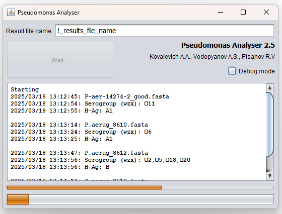

Описание на русском языке расположено ниже

# **Pseudomonas Analyser**
The Pseudomonas Analyser is a program created to analyze data from whole-genome sequencing of *Pseudomonas aeruginosa* strains in order to determine it’s antigenic structure, flagellar antigen, to identify pathogenicity factors, genes determining the mucoid phenotype of the microorganism, and to determine the INDEL locus of high-resolution.
## **Installation:**
The program is launched by unpacking the downloaded archive with the program and running the Pseudomonas Analyser.bat file (Windows version) or the Pseudomonas Analyser.jar (version for Linux and macOS, Windows), the result is output as a text file.
## **Program run:**
* The source data is a fasta-format file, containing either a set of contigs (extended nucleotide sequences resulting from the assembly of de novo short reads, derived from whole-genome sequencing) or the result of a "hybrid" assembly (a set of contigs thoroughly verified "ground" with long reads). The preferred file extension is '".fasta"' or '".fa"'. 
* Fill in the field '"Result file name"' is required. This data will be used as the name of the result file. Clicking on the '"Start"' button a standard window for selecting the source file or files (the program runs in batch mode) for analysis opens. After the selection, the analysis starts automatically. During operation, an indicator in the form of a thin running bar at the bottom of the program window displays the progress of the analysis.

* During operation, the received data is displayed in the result window. After the program is completed, the result is saved in a text file located in the folder with the source fasta files, and the file name matches the data entered in the '"Result file name"' field.

## **Result:**
The results of the analysis of each genome are displayed in a separate line indicating the O- and H-antigenic structure, the identification of pathogenicity factors, and the determination of the genotype by INDEL locus.
## **For citation:**
- Kovalevich A.A., Vodopyanov A.S., Vodopyanov S.O., Temyakova S.U. INDEL-typing of *Pseudomonas aeruginosa* strains. Bacteriology. 2024; 9(4): 75–81. (In Russian). 'DOI: 10.20953/2500-1027-2024-4-75-81'

(https://obolensk.org/images/journal/2024/9-4/2024-9-4%20p75-81%20Kovalevich.pdf)

# **Pseudomonas Analyser**
Программа Pseudomonas Analyser предназначена для анализа данных полногеномного секвенирования штаммов *Pseudomonas aeruginosa* с целью определения антигенной структуры, жгутикового антигена, выявления факторов патогенности, генов определяющих мукоидный фенотип микроорганизма, определения INDEL-локусов с высокой разрешающей способностью.
## **Установка:**
Запуск программы осуществляется путем распаковки скачанного архива с программой и запуска файла Pseudomonas Analyser.bat (версия для Windows) или файла Pseudomonas Analyser.jar (версия для Linux и MacOS, Windows), результат выдается в виде текстового файла.
## **Запуск программы:**
* В качестве исходных данных используется файл в fasta-формате, содержащий либо набор контигов (протяженных нуклеотидных последовательностей - результат сборки de novo коротких ридов, полученных в результате полногеномного секвенирования), либо результат «гибридной» сборки (набор контигов, «отшлифованный» длинными ридами). Предпочтительное расширение файла '«.fasta»' или '«.fa»'. 
* Необходимо заполнить поле '«Result file name»' - эти данные будут использованы в качестве имени файла с результатом. При нажатии на кнопку «Start» открывается стандартное окно выбора исходного файла или файлов (программа работает в пакетном режиме) для анализа. После выбора анализ начинается автоматически. В процессе работы внизу окна программы индикатор в виде тонкой бегущей полосы отображает прогресс анализа. 

* В процессе работы получаемые данные отображаются в окне результата. После завершения работы программы результат сохраняется в текстовом файле, расположенном в папке с исходными fasta-файлами при этом имя файла совпадает с данными, введенными в поле '«Result file name»'.

## **Результат:**
Результаты анализа каждого генома отображается в отдельной строке с указанием О- и Н - антигенной структуры, выявления факторов патогенности, определения генотипа по INDEL-локусам.

## **Для цитирования:**
- Ковалевич А.А., Водопьянов А.С., Водопьянов С.О., Темякова С.Ю. INDEL-типирование штаммов *Pseudomonas аeruginosa*. Бактериология. 2024; 9(4): 75–81. 'DOI: 10.20953/2500-1027-2024-4-75-81'.

(https://obolensk.org/images/journal/2024/9-4/2024-9-4%20p75-81%20Kovalevich.pdf)

